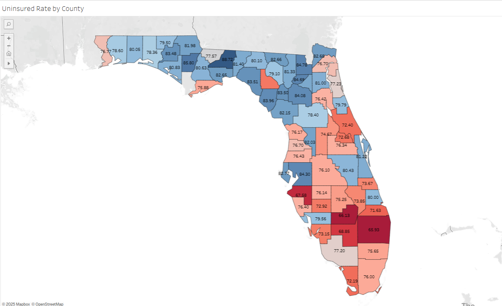
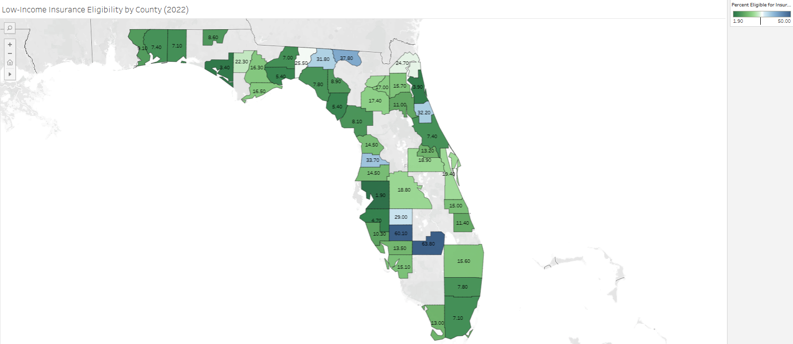
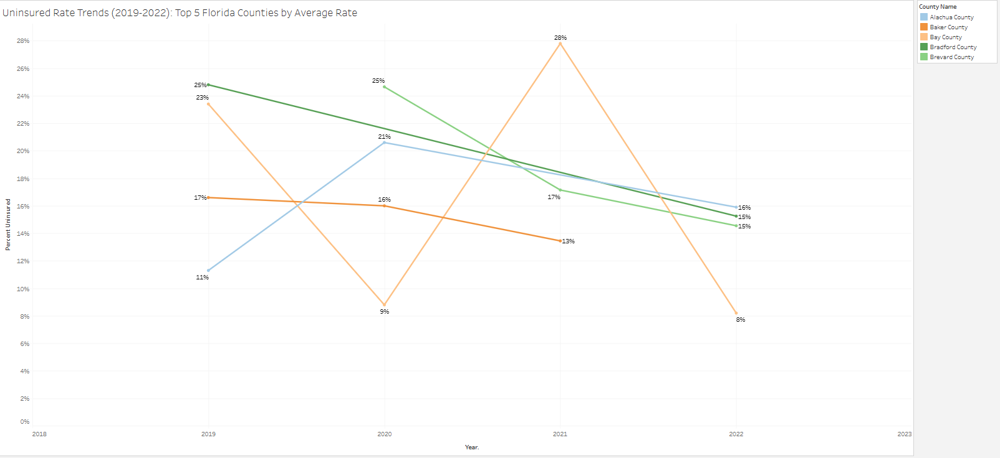

# Florida Health Coverage Insights: Market Gaps & Medicare Expansion
**Identifying high‑priority counties and outreach strategies using ACS, SAHIE and CMS data**

This project investigates healthcare coverage gaps across Florida using a sampled and filtered subset of national datasets too large to upload in full. Our analysis focuses exclusively on Florida counties, aiming to provide data-driven insights into uninsured populations, Medicare eligibility patterns, and coverage trends.

## Executive Summary
This analysis answers five high‑impact, stakeholder‑aligned questions for decision‑makers in healthcare analytics:

**1. Where are Florida’s counties with the highest average uninsured rates from 2019–2022?**  
This guides regional prioritization for enrollment outreach.

**2. How did Florida’s uninsured rates shift after the COVID-19 pandemic?**  
We observe statewide trends and highlight counties that recovered vs. regressed.

**3. How do Medicare eligibility groups break down across income strata in Florida?**  
We analyze CMS Medicare FPL data from 2013–2014 to understand low-income dual-eligibility patterns.

**4. What share of Florida's low-income population remains insurance-eligible in 2022?**  
County-level ACS data allows eligibility estimates for underinsured low-income adults.

**5. Which counties should be prioritized for policy or outreach intervention?**  
We synthesize an index blending uninsured rates and population size to identify high-impact counties.

## Dashboard Overview
The Tableau dashboard features:

- **County Heatmaps (2022):** Visualizing percent uninsured and low-income insurance eligibility.
- **Top 5 Counties Trend Chart:** Shows uninsured rate change (2019–2022).
- **FPL Distribution Bar Charts:** State vs. Florida comparisons for 2013 and 2014.
- **Interactive Filters:** To adjust by income group, region, and year.


## Actionable Recommendations
The cleaned Florida datasets reveal clear patterns that inform outreach and product strategy. Key recommendations are:

- **Focus outreach on counties with both high uninsured percentages and large uninsured populations.**  
In our sample, counties such as Manatee, Seminole, Franklin, Glades, Palm Beach and Pasco exhibit the highest uninsured rates or the biggest increases since 2019. Targeting these areas can maximize enrollment impact.

- **Recalibrate ML targeting models using updated uninsured distributions by income and age.**  
Integrate HI05, HI10, HI11 and HI12 tables to fine‑tune model features for age and poverty strata.

- **Improve data infrastructure in underserved counties.** Some regions lack sufficient reporting, which hinders response.
  
- **Use low-income eligibility rates to fine-tune marketing strategy.** Counties such as Escambia, Pasco, and Polk show over 14% eligibility for public insurance programs.


- **Leverage income-based outreach.** HI13 and HI14 show that many eligible individuals fall below 135% or 150% FPL.

 
- **Monitor post‑pandemic insurance trends.**  
Track counties where uninsured rates remain elevated or are rising despite statewide improvements. Seminole County, for example, saw an increase of more than 18 percentage points between 2019 and 2022, signalling persistent gaps.

- **Target high-risk counties.** Brevard, Palm Beach, and Pasco show high uninsured averages or sharp increases post-COVID.

## Deep Dive: Analytical Approach

### Dataset Overview
This project leverages several U.S. Census and CMS datasets, along with a cleaned subset of Florida county data:

- **SAHIE (Small Area Health Insurance Estimates)** – County‑level uninsured counts and percentages by age, sex and income. Because the raw files are very large, this repository includes sampled Florida‑only CSVs for 2018–2022 (e.g., `sahie_2019_sampled_FL.csv`). The full datasets can be downloaded from the Census site.

- **ACS HI05 / HI10 / HI11 / HI12 / HI15** – State‑level health‑insurance tables providing coverage by age group, sex and income ratio.

- **CMS HI13 / HI14** – Medicare add‑on tables breaking down Medicare participation and dual‑eligibility by state.

- **Insurance CSV** –  Insurance charges are given against the following attributes of the insured: Age, Sex, BMI, Number of Children, Smoker and Region

**Years Used:** 2018–2022 for SAHIE trends; ACS 2022/2023 for current demographic context.

### Analytical Steps
- **Data Cleaning:** Convert Excel and CSV files into long format, clean column names, and import them into MySQL staging tables. For SAHIE, aggregate the Florida samples by county and year to compute total uninsured numbers (`NUI`) and population at risk (`NIPR`), then derive the uninsured percentage (`PCTUI`).

- **Dimension Setup:** Create a county FIPS mapping table to support joins and ensure name consistency across datasets.

- **County‑Level Views:** Use `CREATE VIEW` statements (and supporting SQL scripts) to isolate 2022 data and compute year‑over‑year differences from 2019.

- **Tableau Integration:** Export core views to CSV or connect Tableau directly to MySQL, then build interactive dashboards with filters by year, age and income.

## SQL Scripts
The `sql/` directory contains modular scripts used to build and query the project database:

- `create_tables.sql` – Schema definitions
- `clean_data.sql` – Data-loading and aggregation queries
- `q1_top_uninsured_counties.sql` – Answers Question 1
- `q2_trend_uninsured_change.sql` – Answers Question 2
- `q3_medicare_vs_uninsured.sql` – Answers Question 3
- `q4_demographic_gaps.sql` – Answers Question 4
- `q5_priority_index.sql` – Answers Question 5

## Repository Structure
```
health-insurance-insights/
├── data/
│   ├── cleaned/
│   │   ├── sahie_2019_sampled_FL.csv
│   │   ├── sahie_2020_sampled_FL.csv
│   │   ├── sahie_2021_sampled_FL.csv
│   │   ├── sahie_2022_sampled_FL.csv
│   │   ├── sahie_2019_2022_FL_combined.csv
│   │   ├── combined_acs_insurance_2022.csv
│   │   ├── hi13_cleaned.csv
│   │   └── hi14_cms_cleaned.csv
│   ├── raw/
│   │   ├── hi05_acs.xlsx
│   │   ├── hi10_acs.xlsx
│   │   ├── hi11_acs.xlsx
│   │   ├── hi12_acs.xlsx
│   │   ├── hi15_acs.xlsx
│   │   ├── hi13_cms_medicare_acstable1.xlsx
│   │   ├── hi14_cms_medicare_acstable2.xlsx
│   │   ├── insurance.csv
│   │   └──sahie_data_link.md
├── sql/
│   ├── create_tables.sql
│   ├── clean_data.sql
│   ├── q1_top_uninsured_counties.sql
│   ├── q2_trend_uninsured_change.sql
│   ├── q3_medicare_vs_uninsured.sql
│   ├── q4_demographic_gaps.sql
│   ├── q5_priority_index.sql
├── images/
│   ├── dashboard_preview.png
│   ├── distribution_by_FPL_2013.png
│   ├── distribution_by_FPL_2014.png
│   ├── low-income_insurance_eligibility_by_county.png
│   ├── uninsured_rate_by_county.png
│   └── uninsured_rate_trends.png
├── README.md
└── LICENSE
```

## Tools Used
- **SQL (MySQL)** – Database structure, aggregation and modeling.
- **Excel / Power Query** – Staging and reshaping ACS/SAHIE source files.
- **Tableau Public** – Dynamic dashboards with filters and KPIs.
- **Python (optional)** – Preprocessing and sampling.

## Caveats & Limitations
- Sampled SAHIE data used: Due to file size restrictions, the SAHIE datasets used in this project were sampled and filtered to focus solely on Florida counties. As a result, the findings are illustrative, not definitive. Some counties may be missing from certain years, and trend lines may not fully reflect statewide dynamics.
- Percentage values reflect available data: Percentages shown (e.g. “Insured Rate” or “Eligibility Rate”) are based on the filtered datasets and calculated accurately within those constraints. They do not represent official state averages and should not be interpreted as such.
- Data year alignment: Different datasets reflect different years — e.g., SAHIE (2018–2022), CMS HI13/14 (2013–2014), ACS HI tables (varied). Comparisons across datasets should account for potential temporal misalignment.
- No county-level Medicare data available: CMS HI13 and HI14 provide state-level counts for Medicare beneficiaries across income tiers. Any insights tied to counties are inferred or representative rather than direct measurements.
- Missing or suppressed data: Some counties or variables may have been suppressed due to low counts or non-reporting, especially in rural or underrepresented areas. This can impact the visualizations and rankings.
- Eligibility estimates are modeled: Estimates such as “percent of population eligible for public insurance” were derived using available ACS and CMS data but may not reflect actual program participation or nuanced eligibility criteria.

## Data Sources
- **[SAHIE 2018–2022](https://www.census.gov/data/datasets/time-series/demo/sahie/estimates-acs.html)** – Download from the U.S. Census Bureau SAHIE page.
- **[ACS HI Tables (HI05–HI15)](https://www.census.gov/data/tables/time-series/demo/health-insurance/acs-hi.html)** – Publicly available on the Census Health Insurance Tables.
- **[insurance.csv](https://www.kaggle.com/datasets/teertha/ushealthinsurancedataset?resource=download)** – Insurance Premium Charges in US with important details for risk underwriting.
- **[Statewide uninsured rate reference](https://www.americashealthrankings.org/explore/measures/HealthInsurance)** – United Health Foundation’s America’s Health Rankings 2023 report.

## About the Analyst
**Jeremy Gutierrez** – Data Analyst focused on healthcare and market strategy using SQL, Tableau and AI‑augmented workflows.  
Let’s connect: [LinkedIn](https://www.linkedin.com) | [GitHub](https://www.github.com)
