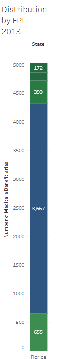
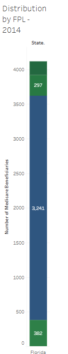

# Florida Health Coverage Insights: Market Gaps & Medicare Expansion
**Identifying high‑priority counties and outreach strategies using ACS, SAHIE and CMS data**

This project analyzes U.S. Census Bureau and CMS Medicare data to pinpoint Florida counties with the highest unmet healthcare coverage needs. Using SQL and Tableau, we identify strategic gaps, model regional risk and deliver actionable insights for product, marketing and enrollment teams.

## Executive Summary
This analysis answers five high‑impact, stakeholder‑aligned questions for decision‑makers in healthcare analytics:

**1. Where are the most underinsured counties in Florida — and how large are those populations?**  
We identify counties with the highest uninsured rates and quantify their market size to guide outreach targeting.

**2. How have coverage rates changed since the pandemic?**  
We compare 2019 to 2022 SAHIE data to assess regional recovery and highlight counties where the uninsured gap is widening.

**3. Which counties show a misalignment between Medicare coverage and uninsured need?**  
By cross‑analyzing Medicare share (HI13/HI14) and county‑level uninsured rates, we flag regions for dual‑eligible expansion.

**4. Which age and income segments remain least insured across Florida?**  
ACS tables (HI05, HI10, HI11, HI12, HI15) reveal demographic coverage gaps that could guide model recalibration or LLM outreach customization.

**5. Where should enrollment outreach be prioritized based on uninsured % and population risk?**  
We build a weighted “Outreach Priority Index” using county‑level z‑scores on uninsured % and population size.

## Dashboard Overview
The Tableau dashboard will include:

- **2022 County Heatmap:** uninsured rates and population overlays.
- **2019 vs. 2022 Comparison:** coverage rate changes post‑pandemic.
- **Targeting Index:** weighted ranking of high‑risk counties.
- **Medicare Context Cards:** income and dual‑eligibility metrics (HI13/HI14).
- **Demographic Gaps:** state‑level charts for coverage by age and poverty.

🔗 [Dashboard link placeholder — coming soon]

## Actionable Recommendations
The cleaned Florida datasets reveal clear patterns that inform outreach and product strategy. Key recommendations are:

- **Focus outreach on counties with both high uninsured percentages and large uninsured populations.**  
In our sample, counties such as Manatee, Seminole, Franklin, Glades, Palm Beach and Pasco exhibit the highest uninsured rates or the biggest increases since 2019. Targeting these areas can maximize enrollment impact.

- **Recalibrate ML targeting models using updated uninsured distributions by income and age.**  
Integrate HI05, HI10, HI11 and HI12 tables to fine‑tune model features for age and poverty strata.

- **Align Medicare expansion strategies with underserved regions.**  
Cross‑analysis of SAHIE and HI13/HI14 data highlights counties where dual‑eligible share is low relative to the uninsured burden; these counties are candidates for new Medicare Advantage plans or dual‑eligible outreach.

- **Build messaging and LLM prompt templates that reflect demographic risk.**  
Use coverage by poverty and age to tailor tone and language for higher engagement, especially among low‑income adults and seniors.

 
- **Monitor post‑pandemic insurance trends.**  
Track counties where uninsured rates remain elevated or are rising despite statewide improvements. Seminole County, for example, saw an increase of more than 18 percentage points between 2019 and 2022, signalling persistent gaps.

## Deep Dive: Analytical Approach

### Dataset Overview
This project leverages several U.S. Census and CMS datasets, along with a cleaned subset of Florida county data:

- **SAHIE (Small Area Health Insurance Estimates)** – County‑level uninsured counts and percentages by age, sex and income. Because the raw files are very large, this repository includes sampled Florida‑only CSVs for 2018–2022 (e.g., `sahie_2019_sampled_FL.csv`). The full datasets can be downloaded from the Census site.

- **ACS HI05 / HI10 / HI11 / HI12 / HI15** – State‑level health‑insurance tables providing coverage by age group, sex and income ratio.

- **CMS HI13 / HI14** – Medicare add‑on tables breaking down Medicare participation and dual‑eligibility by state.

- **Insurance CSV** –  Insurance charges are given against the following attributes of the insured: Age, Sex, BMI, Number of Children, Smoker and Region

**Years Used:** 2018–2022 for SAHIE trends; ACS 2022/2023 for current demographic context.

### Analytical Steps
- **Data Cleaning:** Convert Excel and CSV files into long format, clean column names, and import them into MySQL staging tables. For SAHIE, aggregate the Florida samples by county and year to compute total uninsured numbers (`NUI`) and population at risk (`NIPR`), then derive the uninsured percentage (`PCTUI`).

- **Dimension Setup:** Create a county FIPS mapping table to support joins and ensure name consistency across datasets.

- **County‑Level Views:** Use `CREATE VIEW` statements (and supporting SQL scripts) to isolate 2022 data and compute year‑over‑year differences from 2019.

- **Index Modeling:** Standardize scores (z‑scores) for uninsured % and population and blend them into a composite Outreach Priority Index.

- **Tableau Integration:** Export core views to CSV or connect Tableau directly to MySQL, then build interactive dashboards with filters by year, age and income.

## SQL Scripts
The `sql/` directory contains modular scripts used to build and query the project database:

- `create_tables.sql` – Schema definitions
- `clean_data.sql` – Data-loading and aggregation queries
- `q1_top_uninsured_counties.sql` – Answers Question 1
- `q2_trend_uninsured_change.sql` – Answers Question 2
- `q3_medicare_vs_uninsured.sql` – Answers Question 3
- `q4_demographic_gaps.sql` – Answers Question 4
- `q5_priority_index.sql` – Answers Question 5

## Repository Structure
```
health-insurance-insights/
├── data/
│   ├── cleaned/
│   │   ├── sahie_2019_sampled_FL.csv
│   │   ├── sahie_2020_sampled_FL.csv
│   │   ├── sahie_2021_sampled_FL.csv
│   │   ├── sahie_2022_sampled_FL.csv
│   │   ├── sahie_2019_2022_FL_combined.csv
│   │   ├── combined_acs_insurance_2022.csv
│   │   ├── hi13_cleaned.csv
│   │   └── hi14_cms_cleaned.csv
│   ├── raw/
│   │   ├── hi05_acs.xlsx
│   │   ├── hi10_acs.xlsx
│   │   ├── hi11_acs.xlsx
│   │   ├── hi12_acs.xlsx
│   │   ├── hi15_acs.xlsx
│   │   ├── hi13_cms_medicare_acstable1.xlsx
│   │   ├── hi14_cms_medicare_acstable2.xlsx
│   │   ├── insurance.csv
│   │   └──sahie_data_link.md
├── sql/
│   ├── create_tables.sql
│   ├── clean_data.sql
│   ├── q1_top_uninsured_counties.sql
│   ├── q2_trend_uninsured_change.sql
│   ├── q3_medicare_vs_uninsured.sql
│   ├── q4_demographic_gaps.sql
│   ├── q5_priority_index.sql
├── images/
│   ├── dashboard_preview.png
│   ├── distribution_by_FPL_2013.png
│   ├── distribution_by_FPL_2014.png
│   ├── low-income_insurance_eligibility_by_county.png
│   ├── uninsured_rate_by_county.png
│   └── uninsured_rate_trends.png
├── README.md
└── LICENSE
```

## Tools Used
- **SQL (MySQL)** – Database structure, aggregation and modeling.
- **Excel / Power Query** – Staging and reshaping ACS/SAHIE source files.
- **Tableau Public** – Dynamic dashboards with filters and KPIs.
- **Python (optional)** – Preprocessing, sampling and z‑score calculation.

## Data Sources
- **[SAHIE 2018–2022](https://www.census.gov/data/datasets/time-series/demo/sahie/estimates-acs.html)** – Download from the U.S. Census Bureau SAHIE page.
- **[ACS HI Tables (HI05–HI15)](https://www.census.gov/data/tables/time-series/demo/health-insurance/acs-hi.html)** – Publicly available on the Census Health Insurance Tables.
- **[insurance.csv](https://www.kaggle.com/datasets/teertha/ushealthinsurancedataset?resource=download)** – Insurance Premium Charges in US with important details for risk underwriting.
- **[Statewide uninsured rate reference](https://www.americashealthrankings.org/explore/measures/HealthInsurance)** – United Health Foundation’s America’s Health Rankings 2023 report.

## About the Analyst
**Jeremy Gutierrez** – Data Analyst focused on healthcare and market strategy using SQL, Tableau and AI‑augmented workflows.  
Let’s connect: [LinkedIn](https://www.linkedin.com) | [GitHub](https://www.github.com)
